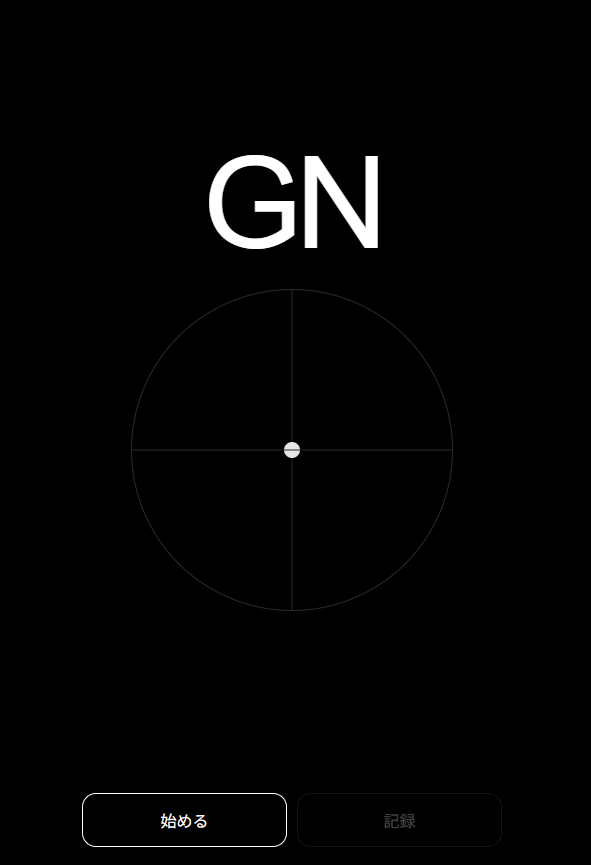

# Glance Note

**Glance Note** is a minimal gaze-controlled web instrument.
It turns your eye movement into sound in the browser and works as a Progressive Web App (PWA).

**Live app:** https://masato-nasu.github.io/Glance-Note/

---

## English

### Overview
Glance Note is a minimal browser-based musical instrument controlled by gaze.

- Look **left / right** to change pitch
- Look **up / down** to change volume
- Tap **Record** to start recording after a short delay
- Tap **Stop** to end recording
- Export the result as a **WAV** file
- Install it as a **PWA** on iPhone, Android, or desktop

The interface is intentionally simple: black background, a central point, and the `GN` mark.

### Live URL
https://masato-nasu.github.io/Glance-Note/

### Features
- Minimal UI
- Gaze-based control
- Sine-wave sound engine
- WAV recording and download
- PWA support
- Designed for mobile and desktop browsers

### How to use
1. Open Glance Note in your browser.
2. Tap **Start**.
3. Allow camera access when prompted.
4. Look at the screen naturally for a moment.
5. Move your gaze:
   - **Left / Right** = pitch
   - **Up / Down** = volume
6. Tap **Record** to start recording.
7. Tap **Stop** to finish and download the WAV file.

### Install as a PWA

#### iPhone / iPad (Safari)
1. Open the live URL in **Safari**.
2. Tap **Share**.
3. Scroll down and tap **Add to Home Screen**.
4. Turn on **Open as Web App** if shown.
5. Tap **Add**. Apple documents this Home Screen web app flow in its iPhone user guide.

#### Android (Chrome)
1. Open the live URL in **Chrome**.
2. Tap the menu.
3. Tap **Add to home screen** and then **Install**.
4. Follow the on-screen steps. Google documents this install flow for Android web apps in Chrome Help.

#### Desktop (Chrome)
1. Open the live URL in **Chrome**.
2. Click the **Install** button in the address bar, or open the menu.
3. Choose **Install page as app**.
4. Follow the on-screen instructions. Google documents this desktop install flow in Chrome Help.

### Notes
- Camera permission is required for gaze control.
- For best results, use the app in a well-lit environment.
- If a previously installed PWA behaves oddly after an update, remove it and reinstall it.

### Files
- `README.md`
- `screenshot1.png`
- App source files

---

## 日本語

### 概要
Glance Note は、**視線で音をコントロールするミニマルなブラウザ楽器**です。Progressive Web App（PWA）として動作します。

- **左右の目線**で音程を変化
- **上下の目線**で音量を変化
- **Record** を押すと少し待って録音開始
- **Stop** で録音終了
- **WAV** 形式で保存可能
- iPhone / Android / デスクトップに **PWA としてインストール可能**

UI は黒背景・中央の点・`GN` だけの、できるだけ透明な構成にしています。

### 公開URL
https://masato-nasu.github.io/Glance-Note/

### 主な機能
- ミニマルUI
- 視線による演奏
- 正弦波ベースの音
- WAV録音と保存
- PWA対応
- モバイル / デスクトップ両対応

### 使い方
1. ブラウザで Glance Note を開きます。
2. **Start** を押します。
3. カメラの使用許可を与えます。
4. しばらく自然に正面を見ます。
5. 視線を動かします。
   - **左右** = 音程
   - **上下** = 音量
6. **Record** を押すと録音が始まります。
7. **Stop** を押すと録音が終わり、WAVを保存できます。

### PWA のインストール方法

#### iPhone / iPad（Safari）
1. **Safari** で公開URLを開きます。
2. **共有** をタップします。
3. 下にスクロールして **ホーム画面に追加** を選びます。
4. 表示される場合は **Open as Web App** を有効にします。
5. **追加** を押します。Apple の iPhone ユーザーガイドでも、この Home Screen 追加手順が案内されています。

#### Android（Chrome）
1. **Chrome** で公開URLを開きます。
2. メニューを開きます。
3. **ホーム画面に追加** → **インストール** を選びます。
4. 画面の案内に従います。Google の Chrome Help でも、この Android 向け web app インストール手順が案内されています。

#### デスクトップ（Chrome）
1. **Chrome** で公開URLを開きます。
2. アドレスバーの **Install** ボタン、またはメニューを開きます。
3. **Install page as app** を選びます。
4. 画面の案内に従います。Google の Chrome Help でも、このデスクトップ向けインストール手順が案内されています。

### 補足
- 視線制御のため、カメラ許可が必要です。
- 目元が明るい方が安定しやすいです。
- 更新後に挙動がおかしい場合は、PWA を一度削除して再インストールしてください。

### 同梱ファイル
- `README.md`
- `screenshot1.png`
- アプリ本体ファイル一式

